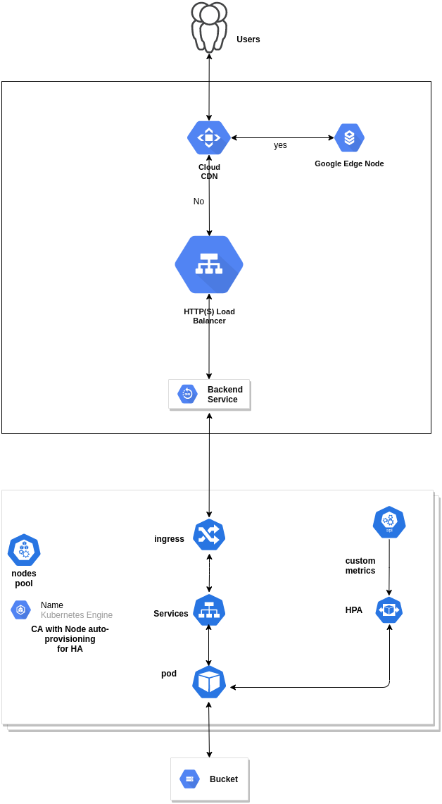

# Image Resize App:
    An application that resize the image on the base of dynamic parameters(width, height, and quality) with watermark.

# Architecture

# Step 01 GKE Cluster: 
    Configure the CI/CD Pipeline for Creating the Cluster Autoscaler of GKE using terraform(IaC)

# Step 02 Install helm chart: 
    Configure the CI/CD Pipeline for building the new helm chart and deploy to the cluster.
    Pipeline will make sure the updated image is deployed on the cluster.
    helm chart will create the following resouces automatically.

### 02.01 BackendConfig:
    BackendConfig with CDN enable for caching the content on the google edge node. 
    It will improve the performance of the app as well as reduce the cost.

Link
    [backendConfig file](helmchart/templates/my-backendconfig.yaml)

### 02.02 Service:
    helm chart will create service to access the deployment pods.
    It will also attach the BackendConfig for CDN.

Link
    [service file](helmchart/templates/service.yaml)

### 02.03 Deployment:
    A deployment for pods with health check(liveness and readiness probe) and resources(request & limits of CPU & Memory). 

Link
    [deployment file](helmchart/templates/deployment.yaml)

### 02.04 Ingress:
    An ingress controller with Google cloud external LB and rules for backend service map. 

Link
    [Ingress file](helmchart/templates/ingress.yaml)

### 02.05 HPA:
    helm chart will create Ingress controller with external LB. 
#### References:
    1. https://kubernetes.io/docs/tasks/run-application/horizontal-pod-autoscale-walkthrough/#autoscaling-on-multiple-metrics-and-custom-metrics
    2. https://cloud.google.com/kubernetes-engine/docs/tutorials/autoscaling-metrics#custom-metric_1
    3. https://github.com/GoogleCloudPlatform/k8s-stackdriver/tree/master/custom-metrics-stackdriver-adapter
    4. https://github.com/kubernetes-sigs/prometheus-adapter/blob/master/docs/config.md

Link
    [HPA file](helmchart/templates/hpa.yaml)

# Step 03 Install Prometheus:
    It will be installed for monitoring the cluster.
    helm install prometheus stable/prometheus-operator

Link
    [detailed document](DetailedDocment.pdf "Detail of READM Detail")