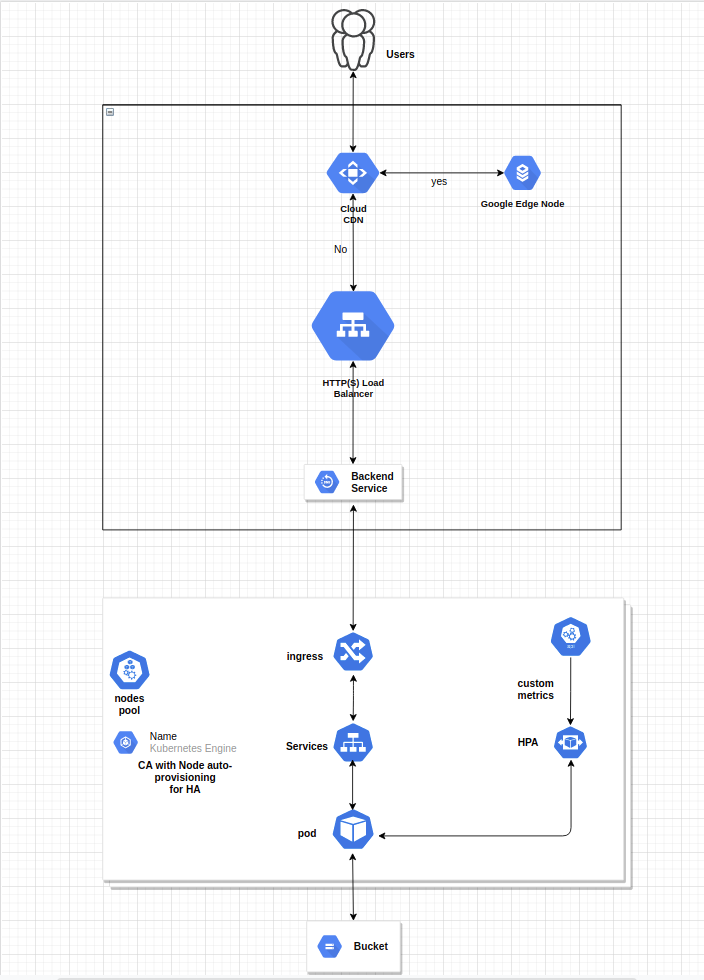

# Architecture

# Step 01:
    Create an application that resize the image on the base of dynamic parameters(width, height, and quality) with watermark.
# Step 02: 
    Create a Cluster Autoscaler of GKE using IaC terraform
### Refernces: 
    https://cloud.google.com/architecture/best-practices-for-running-cost-effective-kubernetes-applications-on-gke
    https://cloud.google.com/kubernetes-engine/docs/best-practices/scalability
    https://registry.terraform.io/providers/hashicorp/google/latest/docs/resources/container_cluster
# Step 03: 
    Configure the CI/CD Pipeline for building the new helm chart and deploy to the cluster.
    CI/CD pipeline will make sure the updated image is deploy on the cluster.
### References:
    https://www.velotio.com/engineering-blog/cicd-for-kubernetes-using-circleci-and-helm
## 01:
    Create a BackendConfig of enable CDN for cache the content on the google edge nodes.
#### Refernces:
    https://cloud.google.com/kubernetes-engine/docs/how-to/ingress-features#cloud_cdn
## 02: 
    Create a service with BackendConfig which created as above to access the deployment pods.
## 03: 
    Create a deployment for pods with health check(liveness and readiness probe) and resources(reques & limits of CPU & Memory).
## 04:
    Create a ingress controller with Google cloud external load balancer and rules for backend service map.
#### References:
    https://cloud.google.com/kubernetes-engine/docs/how-to/load-balance-ingress

## 05:
    Create a HPA with custom metric which we can fetch from Prometheus and stackdriver using adapter
#### References:
    https://kubernetes.io/docs/tasks/run-application/horizontal-pod-autoscale-walkthrough/#autoscaling-on-multiple-metrics-and-custom-metrics
    https://cloud.google.com/kubernetes-engine/docs/tutorials/autoscaling-metrics#custom-metric_1
    https://github.com/GoogleCloudPlatform/k8s-stackdriver/tree/master/custom-metrics-stackdriver-adapter
    https://raw.githubusercontent.com/GoogleCloudPlatform/k8s-stackdriver/master/custom-metrics-stackdriver-adapter/deploy/production/adapter_new_resource_model.yaml
    https://github.com/kubernetes-sigs/prometheus-adapter/blob/master/docs/config.md

## 04: 
    For Load testing we will use Jmeter.

# CPU calculation
    **1CPU=1000Mi**
    _RPS=No. of CPU X (1/Task time)_
    let ust suppose our request take max 5ms per request
    RPS = 1 X (1/5ms)
    RPS = 1000/5
    RPS = 200 of 100% CPU utilization
    but we will configure our autoscaling on 50% utiliztion of CPU so next pod can be ready.
    **50% means 100 RPS**
Links
    [Requests per second (How much CPU/RAM required)](https://www.linkedin.com/pulse/requests-per-second-how-much-cpuram-required-rishi-kumar "Throughput")

# Cost Calculation 
    let's suppose
    cost of 1 CPU = 10$
    1 CPU can hanle approximate 180 request
    100000/175 =  571.42 approximate
    10$ X 572$ = 5720 $ 
